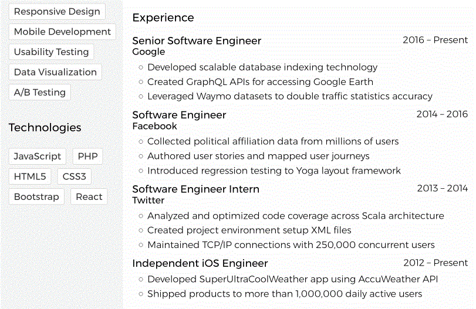
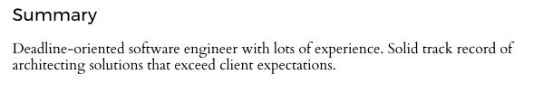
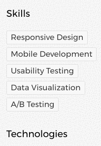
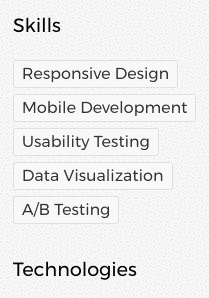
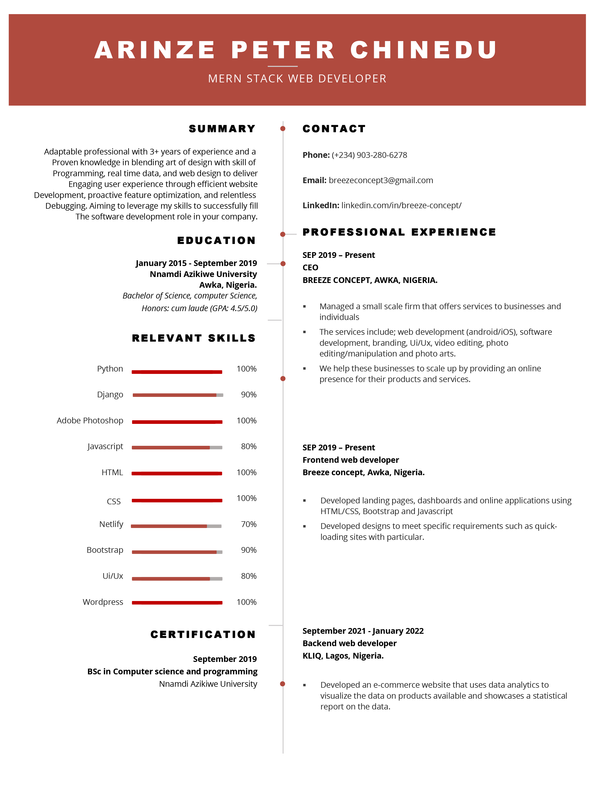

# breezeconcept-resume
My online resume

Single-page resume template built using HTML, CSS, and JS that can be viewed on the web or exported to a PDF.
A live demo is available at [Mr-IRobot.github.io/breezeconcept-resume](https://github.com/Mr-IRobot/breezeconcept-resume/).

## Editing

This template has the ability to edit, and automatically save, inside the browser! The entire page is marked editable with [`document.designMode`](https://developer.mozilla.org/en-US/docs/Web/API/Document/designMode).

The below example is from Firefox (61): adding several list items then refreshing the page.

In most browsers, you can use `Command/CTRL + B/I` to make text bold or italic.

There are also two types of returns, `Shift + Enter`, which adds a ` ` within the current element:

And `Enter`, which is somewhat contextual. If focused after the last character, it can be used to append list elements:

## Sample

## Flexibility

This template can be editted both in HTML and CSS. Just like with [CSS Zen Garden](http://www.csszengarden.com/), you can fully customize the layout and style to suit your needs.

## TODO

- Add feedback when page is saved (or an error occurs)
- Allow custom file names for saved HTML
- Support [Breeze](https://www.breezeconcept.com/support)

## Acknowledgements

This project uses [normalize.css](https://github.com/necolas/normalize.css), fonts from [Google Fonts](https://fonts.google.com/), and icons from [Font Awesome](https://fortawesome.github.io/Font-Awesome/). Dependencies are managed as links to CDNs, no package managers or build tools required. Built by me, [Breeze concept](https://breezeconcept.com).

## Compatibility

Tested on Chrome (67) and Firefox (61) on mac OS (10.13.5).
This software uses `localStorage`, `template`, flexbox, and custom properties and is intended for modern browsers.

## Security & Privacy

This application does not communicate or sync with a server, and all data is saved locally.
It may not be able to save if `localStorage` is disabled for any reason.
